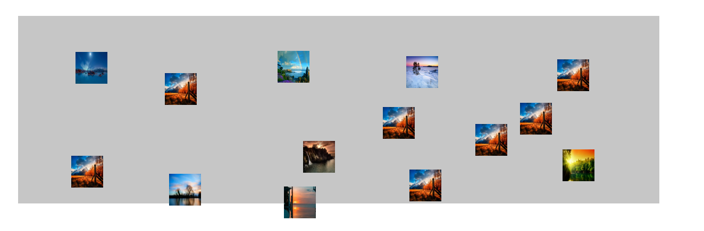

# 随机散列排布

web 端实现在盒子类将指定的子节点随机排列，并不重叠

# 使用方法

hashPosition 函数<br>
参数 1：dom 对象<br>
参数 2：数字时表明排列子元素宽高一样 只针对圆时一样，正方形时宽高都应该是正方形宽的根号 2 倍，参数为对象时<br>
width： 指定子元素宽高固定<br>
minWidth,maxWidth在子元素宽高在范围内时使用
space：指定子元素最小间隔，默认在为最大宽度的0.2倍

#### 宽高一样的圆排列时


demo：

```js
hashPosition(document.getElementById("hash-box"), 40)
```

#### 子元素宽高在一定范围类


demo：

```js
hashPosition(document.getElementById("hash-box1"), {
  minWidth: 20,
  maxWidth: 50,
})
```

#### 方形元素排列


demo：

```js
hashPosition(document.getElementById("hash-box2"), {
  width: 30,
  // 设置方向元素间的间隔 在45对角排列是元素中心点距离是30倍根号2，但width设置30时最小间距是30*0.2，这时需要手动调整间距
  space: 30 * (Math.pow(2, 0.5) - 1),
})
```

#### 长方形元素排列


demo：

```js
hashPosition(document.getElementById("hash-box2"), {
  width: 30,
  // 与正方形思想一直，只是width是长方形的最大边
  space: 30 * (Math.pow(2, 0.5) - 1),
})
```
